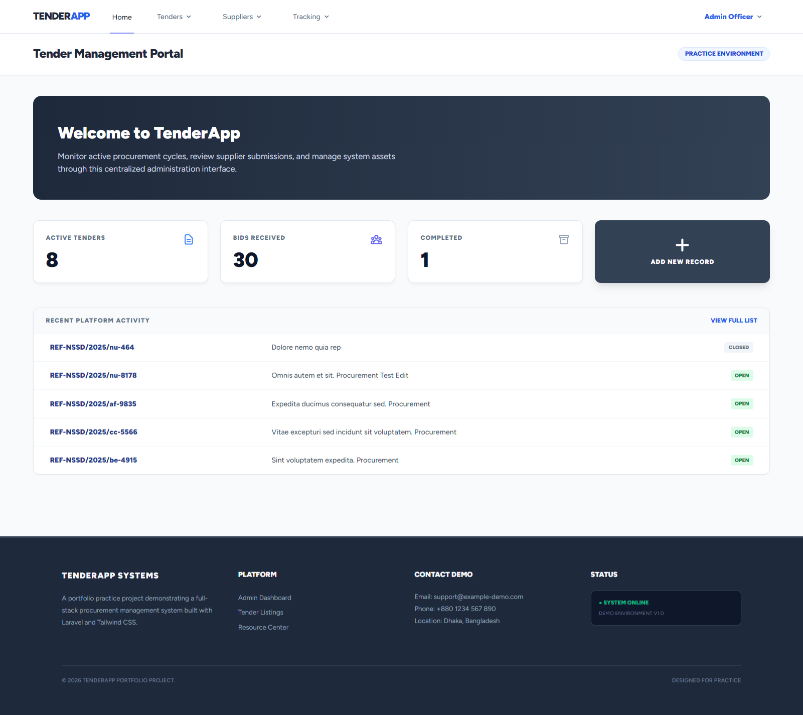
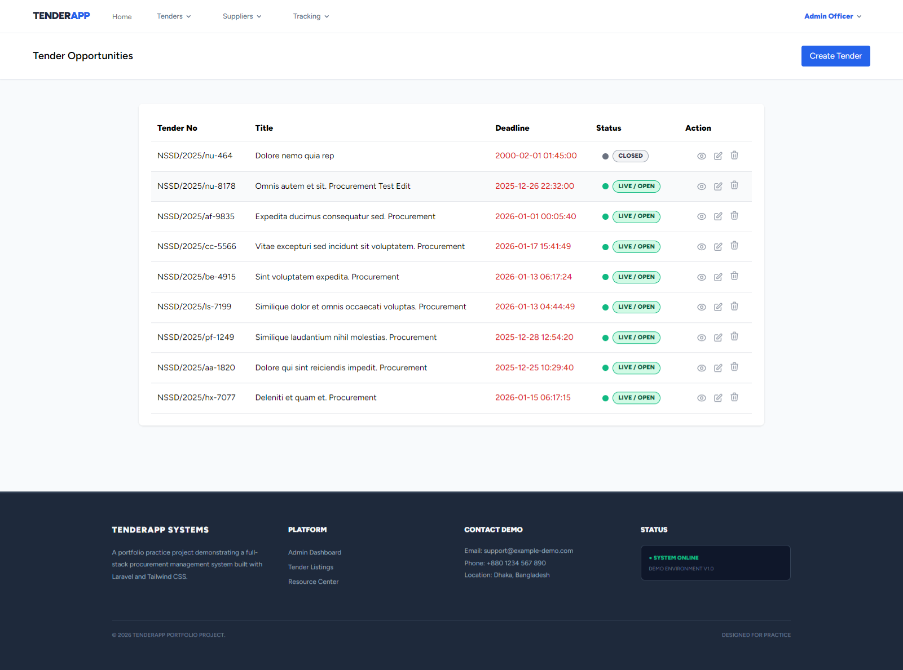
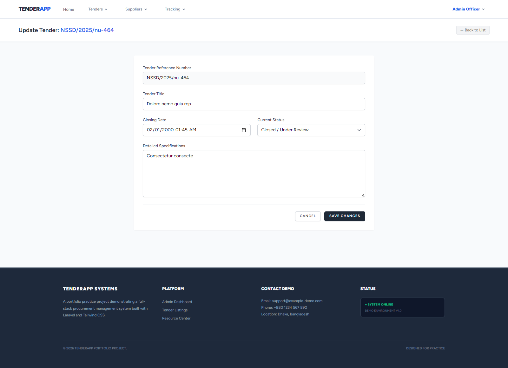
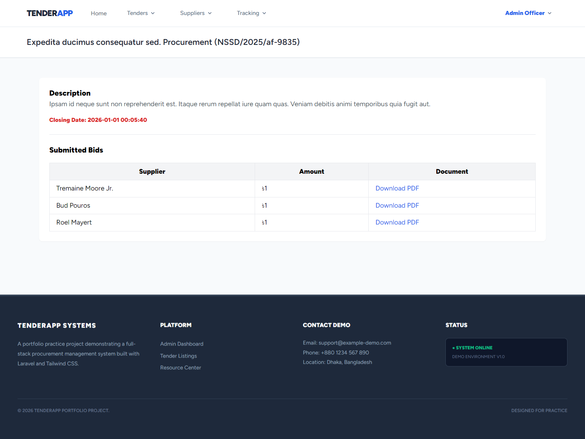

# TenderApp - Procurement Management System (Practice Project)

A professional, full-stack procurement and tender management dashboard built with **Laravel 11**, **Tailwind CSS**, and **Alpine.js**. This project was developed as a practice exercise to demonstrate expertise in building administrative interfaces, managing complex CRUD operations, and designing high-fidelity dashboards.


## 🚀 Overview

TenderApp provides a centralized platform for administrators to manage procurement cycles. It features a responsive, edge-to-edge "Command Center" dashboard that allows for real-time monitoring of active tenders and supplier bids.

### Key Features
* **Live Metrics Dashboard:** Real-time counters for active, closed, and total bids.
* **Edge-to-Edge Layout:** Full-width professional design with responsive card constraints.
* **Tender Management:** Complete CRUD (Create, Read, Update, Delete) for procurement records.
* **System Logs:** Recent activity tracking for administrative oversight.
* **Responsive UI:** Optimized for desktop, tablet, and mobile screens using CSS Grid and Flexbox.
* **Corporate Aesthetic:** Clean, neutral slate and blue theme suitable for enterprise software demos.

## 🛠️ Technical Stack
* **Framework:** [Laravel](https://laravel.com) (PHP)
* **Frontend:** [Tailwind CSS](https://tailwindcss.com) & [Blade Templates](https://laravel.com/docs/11.x/blade)
* **Authentication:** Laravel Breeze
* **Database:** MySQL / PostgreSQL
* **Icons:** Heroicons


## Project Screenshots

### Admin Dashboard
Overview of the system statistics and navigation.


### Tender Management
View all active and closed tender opportunities.


### Create & Edit Tenders
Interface for administrators to publish or update tender details.


### Bid Submissions
View and manage bids submitted by suppliers for specific tenders.


## 📸 Dashboard Preview
The dashboard includes:
1.  **Welcome Banner:** High-contrast greeting with system status.
2.  **Stat Cards:** Color-coded metrics for "Active," "Received," and "Completed" records.
3.  **Action Grid:** Immediate access to create new procurement entries.
4.  **Activity Log:** A streamlined table showing the most recent updates in the system.

## ⚙️ Installation

1. **Clone the repository**
   ```bash
   git clone [https://github.com/yourusername/tender-app.git](https://github.com/yourusername/tender-app.git)
   cd tender-app
